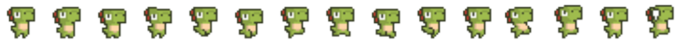
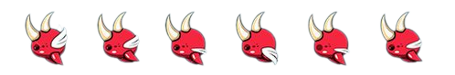
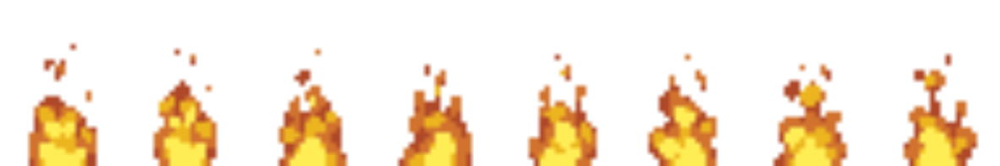

# THE ADVENTURE OF ELEMENTALS

- Thử nghiệm game: 

## Giới thiệu game 
   The adventures of elementals là một game thuộc thể loại platformer game.Bắt đầu vào cuộc chơi, bạn sẽ được theo chân hành trình khám phá của chú khủng long dino vượt qua những chướng ngoại vật để bảo vệ bản thân. Người chơi hãy cố gắng thu thập những bình máu để có thể hồi mạng cho chú khủng long khi bị thương .

- [0. Cách tải game](#0-cách-tải-game)
   
    * [Bao gồm code và có thể biên dịch.](#Bao-gồm-code-và-có-thể-biên-dịch)
- [1.Ý tưởng và các nguồn tham khảo](#1-Ý-tưởng-và-các-nguồn-tham-khảo)
- [2.Bắt đầu game](#2Bắt-đầu-game)
- [3. Các đối tượng trong game:](#3-các-đối-tượng-trong-game)
- [4. Cách chơi](#4-cách-chơi)
- [Về đồ họa của game:](#về-đồ-họa-của-game)
- [Về source code game](#về-source-code-game)

## 0. Cách tải game
- Bản chạy trên IDE hoặc textEditor : clone repo hoặc code -> Download ZIP
## 1.Ý tưởng và nguồn tham khảo 
- Lấy cảm hứng từ game khủng long chạy của google
- Các nguồn hình ảnh trong game :
     [canva](https://www.canva.com/)
     [pinterest](https://www.pinterest.com/)
     [itch.io](https://arks.itch.io/dino-characters)
- Các nguồn tham khảo cho bài code :
  [lazyfool](https://lazyfoo.net/tutorials/SDL/?fbclid=IwAR25TXw-judKGo1Y1SolVN8nld7THDLNbfLVc2kQDxNOoCD0kzUAkCblbDQ)
  [phattrienphanmem](https://www.youtube.com/watch?v=q1WzniyeGTU&list=PLR7NDiX0QsfTIEQUeYCfc2MyCquX0ig9V)

## 2. Bắt đầu game
- Đầu game người chơi sẽ được chọn 2 chế độ trên menu :
  + Start : Click chuột vào nút Start để bắt đầu 
 

 
    
  
   
  + Exit : Click nút exit để thoát game
## 3. Các đối tượng trong game :
- Khủng long xanh (dino) : Là nhân vật trung tâm của trò chơi, vượt qua các chướng ngại vật trên đường đi
  

  
     

 - Con quái bay : Là một con thú đầy sự hung hăng nhằm cản trở hành trình của chú khủng long xanh

  

     
   
   
- Ngọn lửa : Những ngọn lửa cháy hừng hực sẵn sàng thiêu đốt chú khủng long
  

  
- Bình hồi máu: Là những liều thuốc trợ lực cho dino hồi phục lại sức mạnh để đi đến cuối
  

  
## 4.Cách chơi : 
- Người chơi phải điều khiển chú khủng long vượt qua các chướng ngại vật sao cho điểm cao nhất có thể bằng cách dùng phím space để điều khiển chú khủng long nhảy lên
  để tránh con quái và những ngọn lửa .
 
- Ban đầu chú khủng long sẽ có đầy máu được thể hiện bằng 3 hình trái tim bên góc phải màn hình .Khi va chạm phải cách con quái hay là ngọn lửa thì máu của chú sẽ bị hao hụt
  đi, để hồi máu người chơi phải điều khiển chú đoạt các bình hồi máu .
 

    
  

- Bên góc trái màn hình sẽ hiển thị điểm của người chơi .

 
  
- Nếu sử dụng hết máu thì trò chơi kết thúc
- Người chơi có thể chơi lại bằng cách click vào nút NewGame để chơi lại màn mới

 
   
  

## 5. Về đồ họa của game 
- Tạo ra các chuyển động của con khủng long từ hình ảnh dino sprites

   
  

-Tạo ra các chuyển động của con quái từ hình ảnh monster sprites 

   
  

-Tạo các hiệu ứng bập bùng của ngọn lửa từ firesprites 

   

## 6.Về source code của game :
- Background.cpp :Làm nhiệm vụ vẽ các hình nền lên màn hình và cuộn hình nền 
  + Các hàm draw (draw,drawStartButton,...)
  + Hàm update : cuộn hình nền
- Predator.cpp :Xây dựng lớp các chướng ngại vật bao gồm con quái và ngọn lửa để tấn công khủng long
   + Hàm Predator : Khởi tạo vị trí ban đầu cho các con quái, ngọn lửa và loadTexture
   + Hàm draw : vẽ các loại thiên địch lên màn hình
   + Hàm move : Điều khiển di chuyển cho thiên địch
   + Hàm resetPosition : Đặt lại các vị trí cho thiên địch
   + Hàm changeframe : để thay đổi các hình dạng của thiên địch
   + Hàm update : để cập nhật các thay đổi của thiên địch
 - Player.cpp:Xây dựng nhân vật chính là khủng long 
    + Hàm Player : hàm khởi tạo load Texture
    + Hàm draw : vẽ nhân vật chính lên màn hình
    + Hàm update : Để cập nhật trạng thái của khủng long (up,run,float,down)
    + Hàm changeFrame : để thay đổi hình dạng cho khủng long
    + Hàm resetPos : để đặt lại vị trí ban đầu cho khủng long
  - Revival.cpp : Xây dựng cho sự xuất hiện của các bình hồi máu
      + Hàm revival : khởi tạo
      + Hàm draw : vẽ các bình hồi máu
      + Hàm move ,resetPosition : tương tự lớp predator.cpp
      + Hàm collide : Kiểm tra sự va chạm của khủng long với bình
      + Hàm update : tương tự
- Main.cpp :
  + Hàm output : Vẽ các đối tượng lên màn hình
  + Hàm GameStart : Xử lý sự kiện bàn phím và điều khiển game
  + Hàm checkCollision :Kiểm tra sự va chạm của nhân vật với thiên địch
  + Hàm resetgame : làm nhiệm vụ đặt lại game khi chơi thua
  + Các hàm loadsound, loadText, update : để tải âm thanh, font chữ TTF , và làm game chạy mượt hơn

    

  

